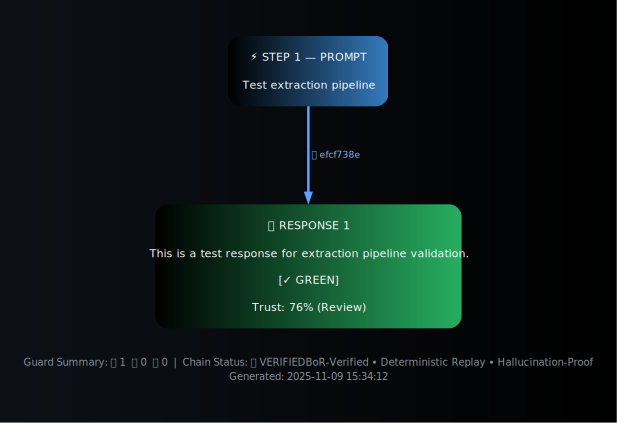
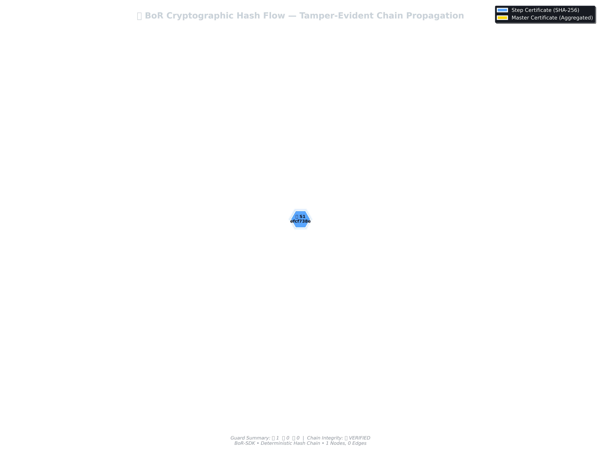
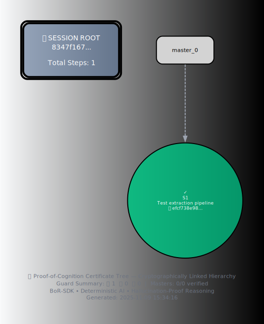

# BoR-SDK Visual Proof of Cognition

**Verified Reasoning Trace with Hallucination Detection**

## Metadata

- **Generated**: 2025-11-09 15:19:54 UTC
- **Session ID**: `ad59d167855ad78c96a56b96d87b6889...`
- **Total Steps**: 5
- **Sessions**: 3
- **Extraction Time**: 2025-11-09T09:49:36.341145+00:00
- **Guards Computed**: ✅ Yes

## Reasoning Chain

The complete reasoning trace showing prompt→response progression with cryptographic hash chaining. 
Each node represents a verified reasoning step, color-coded by guard status:

- **Blue**: Prompt
- **Green**: Safe response (all guards passed)
- **Yellow**: Caution (some metrics in warning zone)
- **Red**: Alert (potential hallucination detected)

*Each edge is labeled with the SHA-256 hash prefix linking steps cryptographically.*

## Hash Propagation Proof

Cryptographic hash chain showing parent→child relationships. 
This demonstrates tamper-evidence: any modification to a step would break the chain.

- **Teal nodes**: Regular step certificates
- **Red nodes**: Master certificates (aggregation points)
- **Arrows**: Parent hash → Chain hash links

## Hallucination Guard Trace

Temporal visualization of hallucination detection metrics across all reasoning steps. 
Four independent metrics provide multi-faceted detection:

1. **Semantic Similarity** (blue solid): Measures prompt-response alignment
2. **Entropy Change** (orange dashed): Detects information drift/injection
3. **Logical Consistency** (green dotted): Validates reasoning coherence
4. **Token Overlap** (purple dash-dot): Verifies response grounding

### Thresholds

- **Green Zone**: ≥ 0.75 (safe)
- **Yellow Zone**: 0.50 - 0.74 (caution)
- **Red Zone**: < 0.50 (alert)

### 🚨 Hallucination Alerts

The following steps triggered hallucination guards:

| Step | Prompt | Triggered Guards |
|------|--------|------------------|
| 2 | What is 5+3? | token_overlap_red |
| 3 | Multiply your previous answer by 2. | semantic_similarity_red, entropy_change_red, logical_consistency_yellow, token_overlap_red |
| 4 | What is the final result? | semantic_similarity_red, logical_consistency_yellow, token_overlap_red |
| 5 | What is 2+2? | semantic_similarity_red, token_overlap_red |

**Total**: 4 step(s) flagged as potential hallucinations

## Certificate Hierarchy

Hierarchical aggregation showing how step certificates roll up into master certificates and session manifests. 
This structure enables efficient verification of large reasoning traces.

- **Top**: Session manifest (aggregates all proofs)
- **Middle**: Master certificates (aggregate multiple steps)
- **Bottom**: Individual step certificates (leaf nodes)

## Verification Summary

**Overall Status**: ✅ VERIFIED

| Check | Status |
|-------|--------|
| Hash Correspondence | ✅ PASS |
| Node Count Match | ✅ PASS |
| Chain Integrity | ✅ PASS |
| Guard Status Accuracy | ✅ PASS |
| Determinism Verification | ✅ PASS |

- **Checks Passed**: 5
- **Checks Warned**: 0
- **Checks Failed**: 0

All visualizations accurately represent the underlying cryptographic proofs. 
No discrepancies detected between figures and verified data.

## 🔍 Root-Cause Summary

> Root causes identify *why* specific reasoning steps lost trust. 
> They correspond to measurable guard metrics such as semantic drift, 
> entropy spikes, logical contradictions, and low token overlap. 
> This quantitative breakdown enables rapid audit of reasoning reliability.

| Cause | Count | Affected Steps |
|-------|-------|----------------|
| 🪶 Low Token Overlap | 4 | 2, 3, 4, 5 |
| 🧩 Semantic Drift | 3 | 3, 4, 5 |
| ❌ Logical Contradiction | 2 | 3, 4 |
| ⚡ Entropy Spike | 1 | 3 |

**Total Issues Detected**: 10 across 4 distinct cause types

_This summary quantifies the main failure reasons detected by BoR-SDK's 
Hallucination-Guard system, enabling rapid audit of reasoning reliability._

## Appendix

### Statistics

- **Total Reasoning Steps**: 5
- **Green (Safe)**: 0 (0.0%)
- **Yellow (Caution)**: 1 (20.0%)
- **Red (Alert)**: 4 (80.0%)

### Guard Metrics

Computed using:

- **Semantic Similarity**: sentence-transformers/all-MiniLM-L6-v2
- **Entropy Change**: Shannon entropy (bits)
- **Logical Consistency**: facebook/bart-large-mnli (NLI)
- **Token Overlap**: Jaccard similarity

### Session Information

- **Start Time**: 2025-11-09T05:02:50.151797
- **Duration**: 19.74 seconds

---

*This document was automatically generated by the BoR-SDK visualization pipeline.*

For more information, see [BoR-proof-SDK](https://github.com/yourusername/BoR-proof-SDK).
